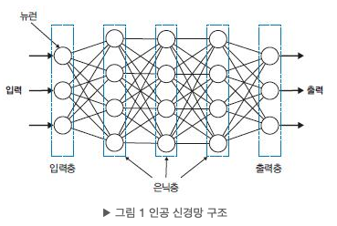

## 1. 순방향 신경망(FNN) 개요

- **FNN** = Feedforward Neural Network (= Fully Connected Neural Network 라고도 부름)  
  대부분의 FNN이 완전연결(fully-connected) 구조를 쓰므로 혼용.
- 다층 퍼셉트론(MLP)의 다른 이름이며 인공 신경망의 가장 기본 형태.
- **범용 근사 정리**(Universal Approximation Theorem): 은닉 뉴런을 충분히 쓰고 적절한 활성함수를 사용하면, *n*차원 연속함수를 임의의 정확도로 **근사**할 수 있음.

---

## 2. FNN의 구조와 설계 항목

FNN은 **데이터가 한 방향으로만 흐르는** 연결을 가짐. 각 뉴런은 *가중합 → 활성함수* 순으로 연산한다.  
데이터 간 상호의존을 직접 가정하지 않는(독립) 구조라는 점이 핵심.

### 2.1 계층 구조

- **입력층**: 외부 데이터 수신  
- **은닉층**: 특징 추출  
- **출력층**: 추론 결과 출력  
입력/출력층은 보통 1개씩, **은닉층 수**는 문제 난이도에 따라 가변.

### 2.2 완전연결(FC) 계층

- 각 층의 **모든 뉴런이 이전층의 모든 뉴런과 연결**.  
- 동일 입력이라도 뉴런마다 **다른 특징**을 뽑아냄 → 특징이 많을수록 **뉴런 수가 충분히** 필요.
- **가중합**: 중요한 feature에 큰 가중치를 두어 영향력 조절  
  $$z = \sum_i w_i x_i + b$$
- **활성함수**: 비선형 변환으로 복잡한 패턴 학습(XOR 등)에 필수.

### 2.3 ReLU (Rectified Linear Unit)

- $$x > 0 \Rightarrow x, \quad x \le 0 \Rightarrow 0$$. 계산이 빠르고 학습을 안정화.  
- 신경망(벡터함수)은 미분 가능한 함수여야 함(역전파).

### 2.4 범용 근사 정리와 깊이

- 2층 FNN도 충분한 은닉 뉴런으로 연속함수 근사 가능.  
- 단, 뉴런을 무작정 늘리면 **과적합** 위험 → **깊게** 쌓아 같은 성능을 더 적은 뉴런으로 구현하기도 함.

### 2.5 설계 체크리스트

1) **입력 형태** 2) **출력 형태/활성함수** 3) **은닉층 활성함수** 4) **네트워크 크기**(깊이·너비)

---

## 3. 분류와 회귀

- **분류**: 범주(클래스) 예측  
- **회귀**: 연속 값 예측

분류는 **판별 함수**(클래스 결정) 또는 **확률 모델**(클래스별 확률)로 볼 수 있다.

---

## 4. 이진 분류 모델

이진 분류는 **베르누이 분포**를 예측하는 모델로 정의할 수 있다.

- 출력층 활성함수: **시그모이드** $$\sigma(z) = \frac{1}{1 + e^{-z}}$$
- 손실함수: **Binary Cross-Entropy**와 궁합이 좋음.

---

## 5. 다중 분류 모델

다중 분류는 **카테고리(다항 1회 시행)** 분포를 예측.

- 출력층 활성함수: **소프트맥스** $\mathrm{softmax}(z)_k=\frac{e^{z_k}}{\sum_j e^{z_j}}$
- 손실함수: **Categorical Cross-Entropy**.

> 이진 분류도 소프트맥스 2차원으로 풀 수 있지만, 보통 시그모이드 1차원으로 간단히 처리.

---

## 6. 회귀 모델

- 회귀는 관측오차(노이즈)가 **가우시안 분포**라고 가정하는 경우가 많음.  
- 모델은 **평균 $$\mu = y(x)$$** 만 예측(분산은 상수로 둠).  
- 출력층 활성함수: **항등함수**(identity).

---

## 7. 입력층

- 입력 데이터가 길이 *n*인 벡터라면 입력층 뉴런 수 = *n*.  
- 예: 28×28 이미지는 **전개(Flatten)** 해서 784차원 입력.

---

## 8. 활성 함수 정리

### 8.1 시그모이드 계열
- 장점: 모든 구간 미분 가능, [0,1]로 **스쿼싱**  
- 단점: 지수연산 비용, **그레이디언트 포화/소실**, 출력이 양수여서 최적화 경로가 진동 가능

### 8.2 하이퍼볼릭 탄젠트(tanh)
- 범위 [-1,1]이라 경로 진동 감소  
- 여전히 지수연산·포화 문제 존재

### 8.3 ReLU 계열
- **ReLU**: 빠르고 포화·소실에 강함  
- **Leaky ReLU / PReLU**: 음수구간 기울기 부여(죽은 ReLU 완화)  
- **ELU**: 음수구간이 지수형 → 큰 음수 입력에도 안정  
- **Maxout**: 뉴런별로 여러 선형함수의 최댓값을 사용해 **활성함수 자체를 학습**  
- **Swish(SiLU)**: $$x \cdot \sigma(x)$$. 최근에 좋은 성능을 보이는 비선형.

---

## 9. 신경망 모델의 크기(너비·깊이)

- **너비**: 층별 뉴런 수 / **깊이**: 층 수  
- 탐색: **Grid Search**보다는 **Random Search**가 대개 효율적.  
- 최근엔 **NAS** 등 자동 탐색도 활용.

### 9.1 크기 스케일링
**EfficientNet**이 보인 바처럼 **너비·깊이·입력 해상도**를 **함께** 키우는 **Compound Scaling**이 효율적.

---


PDF 다운로드

